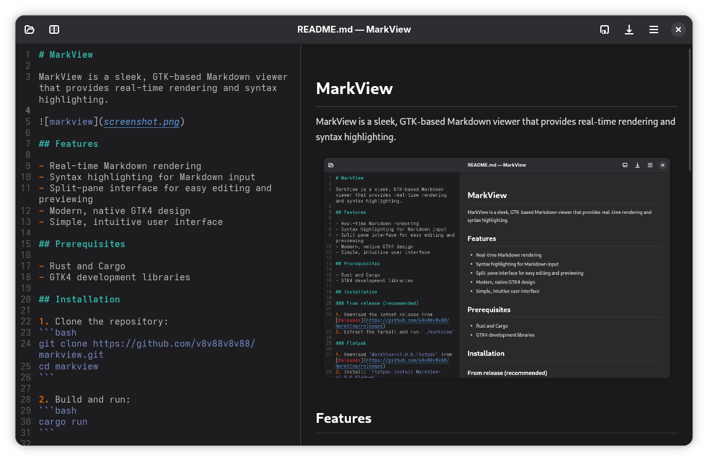

# MarkView

MarkView is a sleek, GTK-based Markdown viewer that provides real-time rendering and syntax highlighting.



## Features

- Real-time Markdown rendering
- Syntax highlighting for Markdown input
- Split-pane interface for easy editing and previewing
- Modern, native GTK4 design
- Simple, intuitive user interface

## Prerequisites

- Rust and Cargo
- GTK4 development libraries

## Installation

1. Clone the repository:
```bash
git clone https://github.com/v8v88v8v88/markview.git
cd markview
```

2. Build and run:
```bash
cargo run
```

## Dependencies

- gtk4 (0.9)
- gio (0.19)
- glib (0.19)
- sourceview5 (0.9)
- pulldown-cmark (0.10)

## Usage

1. Launch MarkView
2. Type Markdown in the left pane
3. View rendered output in real-time on the right pane
4. Use the hamburger menu for additional options

## Contributing

Contributions are welcome! Submit a Pull Request.

## License

GPL v2 License - see [LICENSE](LICENSE) file for details.

## Author

[v8v88v8v88](https://github.com/v8v88v8v88)
